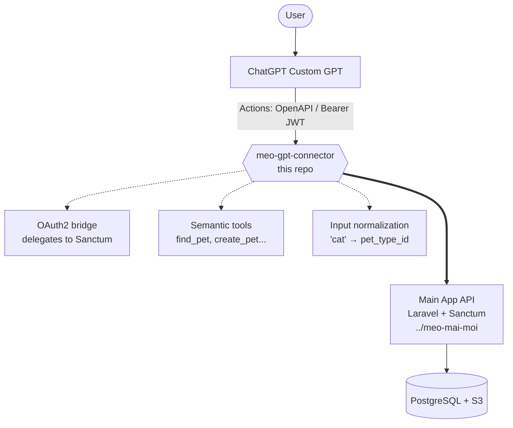

# meo-gpt-connector

A FastAPI service that connects a **ChatGPT Custom GPT** to **[Meo Mai Moi](https://github.com/troioi-vn/meo-mai-moi)** — a pet care platform for rescued cats and the people who care for them.

Users talk to the GPT in natural language. The connector translates that into API calls against the main app, handles OAuth2 authentication, and shapes the responses so the GPT can reason about them.

- Main app in production: [meo-mai-moi.com](https://meo-mai-moi.com)
- GPT bot in production: [GPTchat](https://chatgpt.com/g/g-699f56678d9c81919b1d16246798c30c-meo-mai-moi)


This project serves the same mission as Meo Mai Moi: helping people care for the animals who can't advocate for themselves.

## What it does

**For users:**
- Connect Meo Mai Moi account to ChatGPT with a OAuth flow.
- New users can register during the flow — no invitation code required.
- Create pets, add vaccination records, log medical events, track weights — all by chatting.
- Ask questions: "Who has the closest birthday?" "What vaccinations are due next month?"
- Bulk entry from a photo: "Here's a photo of today's weight session" → ChatGPT reads it, connector stores it.

**For developers:**
- A semantic tool layer, not a REST proxy. Tools are designed for LLM workflows, not mirroring endpoints.
- Nearly stateless: JWTs issued to ChatGPT contain the Sanctum token encrypted inside (AES-256-GCM).
- Redis is only used during the OAuth handshake (short-lived codes). No user session database.

## Architecture



**Auth in one sentence:** ChatGPT redirects the user to the main app's consent page, the main app returns a Sanctum token, the connector wraps it in a signed JWT and hands it to ChatGPT. Every subsequent action call includes that JWT; the connector decrypts the Sanctum token and forwards it.

## Stack

| Concern | Choice |
|---|---|
| Framework | Python + FastAPI |
| Validation | Pydantic v2 |
| HTTP client | httpx (async) |
| Auth tokens | python-jose (JWT) + cryptography (AES-GCM) |
| Temp state | Redis (auth codes only) |
| Logging | structlog (JSON in prod) |
| Container | Docker (single container + Redis sidecar) |


## Development setup

Full guide: **[docs/install.md](docs/install.md)**

```bash
git clone <repo-url> && cd meo-gpt-connector
python3 -m venv .venv && source .venv/bin/activate
pip install -e ".[dev]"

cp .env.example .env
# Fill in .env (ENCRYPTION_KEY, JWT_SECRET, etc.)

docker compose up --build
# Connector: http://localhost:8001
# Health:    http://localhost:8001/health
# OpenAPI:   http://localhost:8001/docs

pytest   # all tests, no live services needed
```

Of course, you also should have the [main app](htttp://github.com/troioi-vn/meo-mai-moi) running locally to test the full flow.

## Key documents

| Document | Purpose |
|---|---|
| [`docs/install.md`](docs/install.md) | Dev setup, running locally, Docker, tests, common issues |
| [`docs/release.md`](docs/release.md) | Release process: versioning, git tags, branching |

## Related

- **[Meo Mai Moi](http://meo-mai-moi.com)** — the main app this connector talks to
- **[Catarchy](https://catarchy.space)** — where it all started
- **[Patreon](https://www.patreon.com/catarchy)** — how the project sustains itself